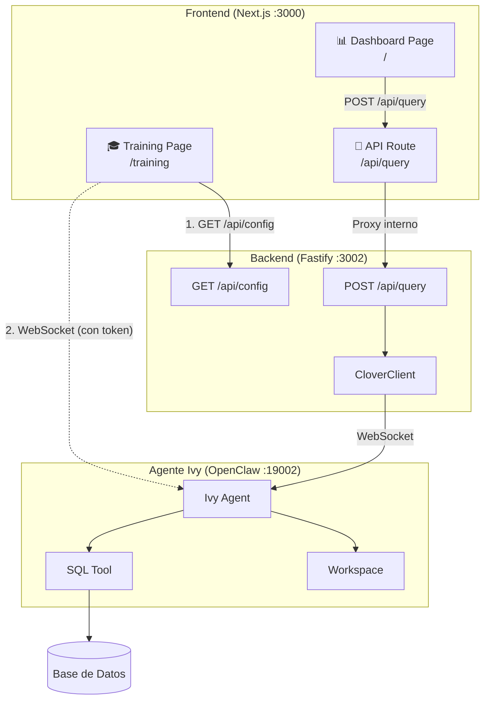
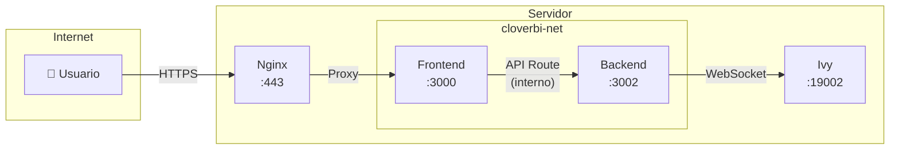

# 🍀 Clover BI - Arquitectura

## Visión General



---

## Componentes

| Capa | Tecnología | Puerto | Función |
|------|------------|--------|---------|
| Frontend | Next.js + React | 3000 | UI, Training, Dashboard viewer |
| API Route | Next.js | - | Proxy interno a Backend |
| Backend | Fastify | 3002 | API REST, Config, Proxy a Ivy |
| Agent | OpenClaw (Ivy) | 19002 | NL→SQL, genera HTML |
| DB | PostgreSQL/MSSQL/MySQL | - | Datos del cliente |

---

## Arquitectura de Red (Producción)



**Importante:** El backend NO está expuesto públicamente. Solo el frontend recibe tráfico externo.

---

## API Route (Frontend)

El frontend incluye un API Route que actúa como proxy interno al backend:

**Archivo:** `/src/app/api/query/route.ts`

```typescript
// POST /api/query
export async function POST(request: Request) {
  const body = await request.json()
  const backendUrl = process.env.BACKEND_URL || 'http://localhost:3002'
  
  const response = await fetch(`${backendUrl}/api/query`, {
    method: 'POST',
    headers: { 'Content-Type': 'application/json' },
    body: JSON.stringify(body),
  })
  
  const data = await response.json()
  return Response.json(data)
}
```

### ¿Por qué API Route?

| Sin API Route ❌ | Con API Route ✅ |
|------------------|------------------|
| Backend expuesto en Nginx | Backend solo interno |
| URL hardcodeada en cliente | Proxy transparente |
| CORS necesario | Sin CORS (mismo origen) |
| Más superficie de ataque | Mínima exposición |

---

## Endpoints del Backend

| Método | Ruta | Descripción |
|--------|------|-------------|
| GET | /health | Health check |
| GET | /api/config | Devuelve gatewayUrl y gatewayToken |
| POST | /api/query | Envía prompt a Ivy, devuelve HTML |

### GET /api/config

Devuelve la configuración para conectar a Ivy (Training mode).

**Response:**
```json
{
  "gatewayUrl": "wss://clover.neosolutions.com.ar/",
  "gatewayToken": "b7de372ef0d3a2e..."
}
```

El frontend usa estos valores para establecer conexión WebSocket directa con Ivy.

---

## Secuencia 1: TRAINING

**Ruta:** `/training`  
**Flujo:** Frontend → Backend (config) → Frontend → Ivy (WebSocket)  
**Prefijo:** `[TRAINING]`

```mermaid
sequenceDiagram
    participant U as 👤 Usuario
    participant F as 🖥️ Frontend<br/>(/training)
    participant B as ⚙️ Backend<br/>(:3002)
    participant I as 🌿 Ivy Agent
    participant S as 🔧 SQL Tool
    participant DB as 🗄️ Base de Datos
    participant W as 📁 Workspace

    U->>F: Abre /training
    F->>B: GET /api/config
    B->>F: {gatewayUrl, gatewayToken}
    F->>I: WebSocket connect (con token)
    I->>F: hello-ok
    F->>F: ✅ Conectado
    
    rect rgb(40, 40, 80)
        Note over F,I: Prefijo [TRAINING] en cada mensaje
    end
    
    U->>F: "Hola"
    F->>I: [TRAINING] Hola
    I->>W: Lee database.env
    
    alt Sin credenciales
        I->>F: "Necesito: Host, Puerto,<br/>Usuario, Pass, Motor, DB"
        U->>F: Envía 6 campos
        F->>I: [TRAINING] credenciales
        I->>W: Guarda database.env
        I->>S: SELECT 1 (test)
        S->>DB: SELECT 1
        DB->>S: OK
        I->>S: information_schema
        S->>DB: Query estructura
        DB->>S: Tablas + columnas
        I->>W: Guarda schema.md
        I->>F: "✅ Conectado!<br/>76 tablas encontradas"
    end
    
    U->>F: "Ventas por sucursal"
    F->>I: [TRAINING] Ventas por sucursal
    
    rect rgb(60, 80, 40)
        Note over I: TRAINING = Explica SIN HTML
    end
    
    I->>F: "📊 Tabla: ventas<br/>🔍 SQL: SELECT...<br/>📈 Gráfico: barras<br/>¿Te parece?"
    
    U->>F: "Sí"
    F->>I: [TRAINING] Sí
    I->>W: Guarda memory/consultas.md
    I->>F: "✅ Guardado!"
```



### Archivos generados:
```
workspace/
├── database.env     # Credenciales
├── schema.md        # Estructura DB (76 tablas, 672 cols)
└── memory/
    └── consultas_dashboards.md  # Queries aprendidas
```

---

## Secuencia 2: DASHBOARD

**Ruta:** `/`  
**Flujo:** Frontend → API Route → Backend → Ivy  
**Prefijo:** `[DASHBOARD]`

```mermaid
sequenceDiagram
    participant U as 👤 Usuario
    participant F as 🖥️ Frontend<br/>(/)
    participant AR as 🔌 API Route<br/>(/api/query)
    participant B as ⚙️ Backend<br/>(:3002)
    participant CC as 🔌 CloverClient
    participant I as 🌿 Ivy Agent
    participant S as 🔧 SQL Tool
    participant DB as 🗄️ Base de Datos

    U->>F: "Ventas por sucursal"
    U->>F: Click Consultar
    
    F->>AR: POST /api/query<br/>{prompt, darkMode: true}
    AR->>B: POST /api/query<br/>(proxy interno)
    
    B->>CC: query(prompt, {darkMode})
    CC->>I: WebSocket connect
    CC->>I: Auth (token)
    I->>CC: hello-ok
    
    CC->>I: chat.send<br/>"[DASHBOARD] Theme: dark.<br/>Ventas por sucursal"
    
    rect rgb(60, 80, 40)
        Note over I: DASHBOARD = HTML puro
    end
    
    I->>S: Ejecuta SQL
    S->>DB: SELECT sucursal, SUM...
    DB->>S: [{sucursal: "Centro", total: 2500000}, ...]
    S->>I: {success, data}
    
    I->>I: Genera HTML+CSS+Chart.js
    
    I->>CC: "<!DOCTYPE html>...<br/>KPIs + Charts + Informe<br/>...</html>"
    
    CC->>CC: extractHtml()
    CC->>B: {html: "...", mode: "ivy"}
    
    B->>AR: {html}
    AR->>F: {html}
    
    F->>F: <iframe srcdoc={html} />
    U->>U: Ve dashboard interactivo
```



### Estructura del HTML:
```html
<!DOCTYPE html>
<html>
<head>
  <script src="chart.js"></script>
  <style>/* Dark theme */</style>
</head>
<body>
  <!-- Header -->
  <div class="header">📊 Ventas por Sucursal</div>
  
  <!-- KPIs -->
  <div class="kpi-grid">
    <div>Total: $12.5M</div>
    <div>Sucursales: 6</div>
    ...
  </div>
  
  <!-- Charts -->
  <div class="charts-grid">
    <canvas id="chart1"></canvas>
    <canvas id="chart2"></canvas>
  </div>
  
  <!-- Informe -->
  <div class="informe">
    📋 Informe
    🔍 Centro lidera con 35%
    📈 Tendencia: +12%
    ⚠️ Sur cayó 8%
  </div>
  
  <script>new Chart(...)</script>
</body>
</html>
```

---

## Comparación de Flujos

| Aspecto | 🎓 Training | 📊 Dashboard |
|---------|------------|--------------|
| Ruta | `/training` | `/` |
| Prefijo | `[TRAINING]` | `[DASHBOARD]` |
| Config | GET /api/config primero | No necesita |
| Conexión a Ivy | Frontend → Ivy (WebSocket directo) | API Route → Backend → Ivy |
| Respuesta | Texto explicativo | HTML completo |
| Propósito | Aprender DB | Visualizar datos |
| Guarda archivos | ✅ Sí | ❌ No |

---

## Variables de Entorno

### Frontend
| Variable | Descripción | Default |
|----------|-------------|---------|
| `BACKEND_URL` | URL del backend (interno) | `http://localhost:3002` |

### Backend
| Variable | Descripción | Default |
|----------|-------------|---------|
| `PORT` | Puerto del servidor | `3002` |
| `GATEWAY_URL` | URL WebSocket de Ivy | - |
| `GATEWAY_TOKEN` | Token de autenticación | - |

---

## Paleta de Colores

### Dark Mode (default)
```css
--bg-primary: #0f172a;
--bg-secondary: #1e293b;
--bg-card: #334155;
--text-primary: #f8fafc;
--text-secondary: #94a3b8;
--accent: #10b981;  /* Verde Clover */
```

### Light Mode
```css
--bg-primary: #f8fafc;
--bg-secondary: #ffffff;
--bg-card: #f1f5f9;
--text-primary: #0f172a;
--text-secondary: #475569;
--accent: #10b981;
```

---

## Seguridad

| Riesgo | Mitigación |
|--------|------------|
| SQL Injection | Queries validadas por Ivy |
| XSS | iframe sandbox aísla JS |
| Datos sensibles | Credenciales en workspace aislado |
| Token expuesto | Config solo via Backend, no hardcodeado |
| Backend expuesto | Solo accesible internamente via API Route |
| Abuso | Rate limiting + auth |

---

*Actualizado: 2026-02-14*  
*Clover BI - Digital Flow*
