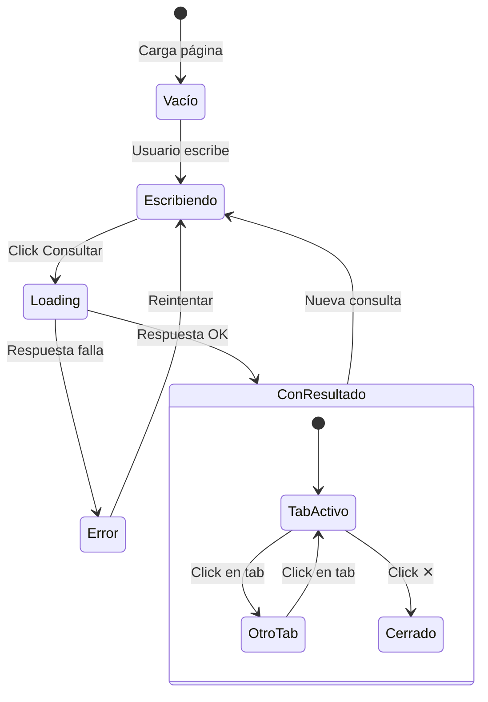
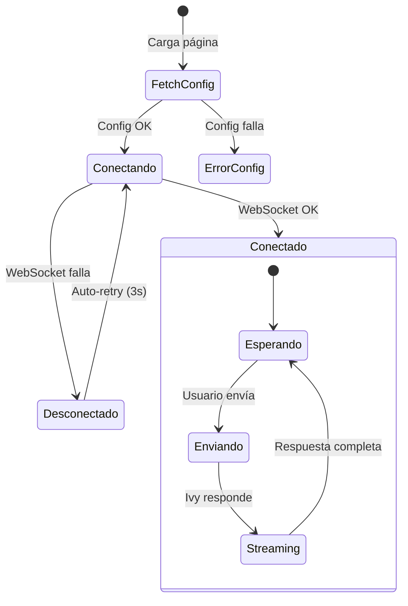
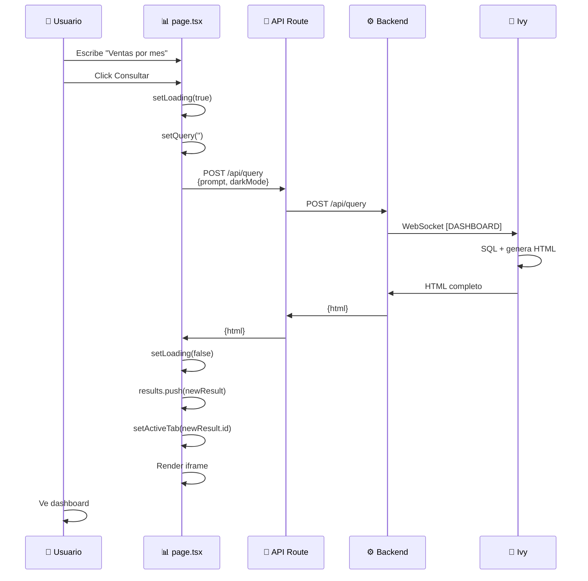

# 🖥️ Clover BI - Frontend

## Estructura de Archivos

```
frontend/
├── src/
│   └── app/
│       ├── layout.tsx          # Layout global
│       ├── page.tsx            # 📊 Dashboard (/)
│       ├── training/
│       │   └── page.tsx        # 🌿 Training (/training)
│       └── api/
│           ├── query/
│           │   └── route.ts    # Proxy a POST /api/query
│           └── config/
│               └── route.ts    # Proxy a GET /api/config
├── package.json
├── tailwind.config.ts
└── Dockerfile
```

---

## Páginas

### 📊 Dashboard (`/`)

**Propósito:** Consultas en lenguaje natural → Dashboard visual

**Componentes:**
- Header con logo, link a Training, toggle dark/light
- Tabs de resultados (múltiples dashboards abiertos)
- Área principal (iframe o estado vacío)
- Input fijo abajo con sugerencias

**Estado:**
```typescript
const [query, setQuery] = useState('')           // Input actual
const [results, setResults] = useState<Result[]>([])  // Tabs de resultados
const [loading, setLoading] = useState(false)    // Spinner
const [activeTab, setActiveTab] = useState<string | null>(null)  // Tab seleccionado
const [error, setError] = useState<string | null>(null)
const [darkMode, setDarkMode] = useState(true)
```

**Flujo:**



---

### 🌿 Training (`/training`)

**Propósito:** Chat directo con Ivy para enseñarle sobre la DB

**Componentes:**
- Header con estado de conexión (●/○)
- Chat area (mensajes user/assistant/system)
- Sidebar con acciones rápidas y info DB
- Input de chat

**Estado:**
```typescript
const [messages, setMessages] = useState<Message[]>([])
const [input, setInput] = useState('')
const [connected, setConnected] = useState(false)
const [connecting, setConnecting] = useState(true)
const [darkMode, setDarkMode] = useState(true)
const [config, setConfig] = useState<GatewayConfig | null>(null)
const wsRef = useRef<WebSocket | null>(null)
```

**Flujo:**



---

## API Routes

### POST `/api/query`

**Archivo:** `src/app/api/query/route.ts`

**Función:** Proxy al backend para consultas dashboard

```typescript
// Request del frontend
POST /api/query
{
  "prompt": "Ventas por sucursal",
  "darkMode": true
}

// Internamente hace:
fetch(`${BACKEND_URL}/api/query`, { ... })

// Response al frontend
{
  "html": "<!DOCTYPE html>..."
}
```

**¿Por qué proxy?**
- Backend no expuesto a internet
- Sin problemas de CORS
- Centraliza manejo de errores

---

### GET `/api/config`

**Archivo:** `src/app/api/config/route.ts`

**Función:** Obtener config de conexión a Ivy (para Training)

```typescript
// Request del frontend
GET /api/config

// Internamente hace:
fetch(`${BACKEND_URL}/api/config`, { cache: 'no-store' })

// Response al frontend
{
  "gatewayUrl": "wss://clover.neosolutions.com.ar/",
  "gatewayToken": "b7de372..."
}
```

---

## Flujo Dashboard (Detallado)



---

## Flujo Training (Detallado)

```mermaid
sequenceDiagram
    participant U as 👤 Usuario
    participant T as 🌿 training/page.tsx
    participant AR as 🔌 /api/config
    participant BE as ⚙️ Backend
    participant IVY as 🌿 Ivy

    T->>T: useEffect mount
    T->>AR: GET /api/config
    AR->>BE: GET /api/config
    BE->>AR: {gatewayUrl, token}
    AR->>T: {gatewayUrl, token}
    
    T->>IVY: new WebSocket(gatewayUrl)
    IVY->>T: connect.challenge
    T->>IVY: connect (con token)
    IVY->>T: hello-ok
    T->>T: setConnected(true)
    
    rect rgb(40, 80, 40)
        Note over U,IVY: Chat loop
    end
    
    U->>T: Escribe mensaje
    U->>T: Click Enviar
    
    T->>T: addMessage(user)
    T->>T: addMessage(assistant, '...')
    
    T->>IVY: chat.send [TRAINING] msg
    
    loop Streaming
        IVY->>T: agent event (texto parcial)
        T->>T: Actualiza último mensaje
    end
    
    IVY->>T: phase: end
    U->>U: Ve respuesta completa
```



---

## Componentes UI

### Header
```
┌─────────────────────────────────────────────────────────────┐
│ 🍀 Clover BI    [🌿 TRAINING]       🌙  [🌿 Training]  [D] │
└─────────────────────────────────────────────────────────────┘
```

### Tabs (Dashboard)
```
┌─────────────────────────────────────────────────────────────┐
│ [Ventas por mes ✕] [Top clientes ✕] [Stock bajo ✕]         │
└─────────────────────────────────────────────────────────────┘
```

### Estado Vacío (Dashboard)
```
              🍀
     ¿Qué querés saber?

  [¿Cuánto vendimos?] [Top 10]
  [Por categoría] [Q1 vs Q2]
```

### Chat (Training)
```
┌─────────────────────────────────────┬─────────────────┐
│                                     │ Acciones Rápidas│
│  ✅ Conectado con Ivy              │ [🔍 Explorar DB]│
│                                     │ [📋 Ver ventas] │
│              [Hola]                 │                 │
│  [Hola! Soy Ivy...]                │ Base de Datos   │
│                                     │ SQL Server      │
│              [Muéstrame ventas]     │ demo_bi         │
│  [Claro, la tabla ventas...]       │                 │
│                                     │ Tips            │
├─────────────────────────────────────┤ • Explicá tablas│
│ [Enseñale algo a Ivy...   ][Enviar]│ • Da ejemplos   │
└─────────────────────────────────────┴─────────────────┘
```

---

## WebSocket Protocol (Training)

### Conexión
```javascript
// 1. Conectar
ws = new WebSocket(gatewayUrl)

// 2. Challenge recibido
{"event": "connect.challenge", ...}

// 3. Autenticar
ws.send({
  type: 'req',
  method: 'connect',
  params: {
    auth: { token: gatewayToken },
    role: 'operator',
    ...
  }
})

// 4. OK
{"type": "res", "ok": true, "payload": {"type": "hello-ok"}}
```

### Enviar mensaje
```javascript
ws.send({
  type: 'req',
  method: 'chat.send',
  params: {
    sessionKey: 'agent:main:training',
    message: '[TRAINING] ' + userMessage
  }
})
```

### Recibir respuesta (streaming)
```javascript
// Texto parcial
{"event": "agent", "payload": {"stream": "assistant", "data": {"text": "...acumulado"}}}

// Fin
{"event": "agent", "payload": {"data": {"phase": "end"}}}
```

---

## Variables de Entorno

| Variable | Descripción | Default |
|----------|-------------|---------|
| `BACKEND_URL` | URL del backend (interno) | `http://localhost:3002` |

**Nota:** En producción, usar nombre de contenedor:
```
BACKEND_URL=http://cloverbi-backend:3002
```

---

## Dark/Light Mode

Toggle con `🌙`/`☀️` en header.

```typescript
const [darkMode, setDarkMode] = useState(true)

useEffect(() => {
  if (darkMode) {
    document.documentElement.classList.remove('light')
  } else {
    document.documentElement.classList.add('light')
  }
}, [darkMode])
```

Se pasa a Ivy en el prompt para que genere HTML con el theme correcto.

---

## Manejo de Errores

| Error | Dónde | Handling |
|-------|-------|----------|
| Backend no responde | Dashboard | Muestra banner rojo |
| Config falla | Training | Mensaje system "❌ Error" |
| WebSocket cierra | Training | Auto-retry cada 3s |
| Respuesta sin HTML | Dashboard | Muestra error genérico |

---

*Actualizado: 2026-02-14*  
*Clover BI - Digital Flow*
