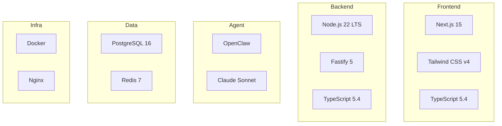

# 🍀 Clover BI - Stack Tecnológico

## Resumen



---

## Frontend (Lo último 🔥)

| Tecnología | Versión | Por qué |
|------------|---------|---------|
| **Next.js** | 15 | App Router, Server Components, Turbopack |
| **Tailwind CSS** | v4 | Nuevo engine, CSS-first config |
| **TypeScript** | 5.4+ | Tipos mejorados |
| **React** | 19 | Server Components, Actions |

---

## Backend

| Tecnología | Versión | Por qué |
|------------|---------|---------|
| **Node.js** | 22 LTS | Último LTS, --watch nativo |
| **Fastify** | 5 | Más rápido que Express |
| **TypeScript** | 5.4+ | Consistencia |
| **Prisma** | 6 | ORM moderno |

---

## Agent (Clover)

| Tecnología | Por qué |
|------------|---------|
| **OpenClaw** | Nuestro framework |
| **Claude Sonnet 4** | Balance costo/calidad |
| **Chart.js 4** | Embebido en HTML |

---

## Base de Datos

| Tecnología | Versión | Uso |
|------------|---------|-----|
| **PostgreSQL** | 16 | DB principal |
| **Redis** | 7 | Cache opcional |

---

## Dev Experience (Hot Reload 🔥)

### Frontend

```bash
npm run dev  # Next.js Fast Refresh + Turbopack
```
- Cambios instantáneos sin perder estado
- Turbopack: 10x más rápido que Webpack

### Backend

```json
{
  "scripts": {
    "dev": "tsx watch src/index.ts"
  }
}
```
- **tsx watch**: Hot reload con TypeScript nativo
- Alternativa: `node --watch` (Node 22 nativo)

### Docker Compose Dev

```yaml
services:
  frontend:
    volumes:
      - ./frontend/src:/app/src
    command: npm run dev

  backend:
    volumes:
      - ./backend/src:/app/src
    command: npm run dev
```

**Cambias código → Se refleja instantáneamente** ⚡

---

## Estructura de Proyecto

```
clover-bi/
├── frontend/
│   ├── src/app/
│   └── Dockerfile
├── backend/
│   ├── src/
│   └── Dockerfile
├── agent/
│   └── openclaw.json
├── docker-compose.yml
└── docker-compose.dev.yml
```

---

*Siguiente: [04-MVP](04-mvp.md)*
