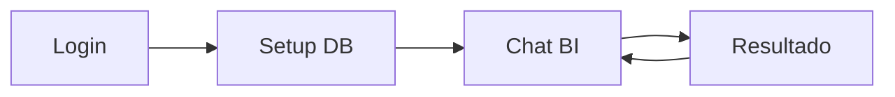
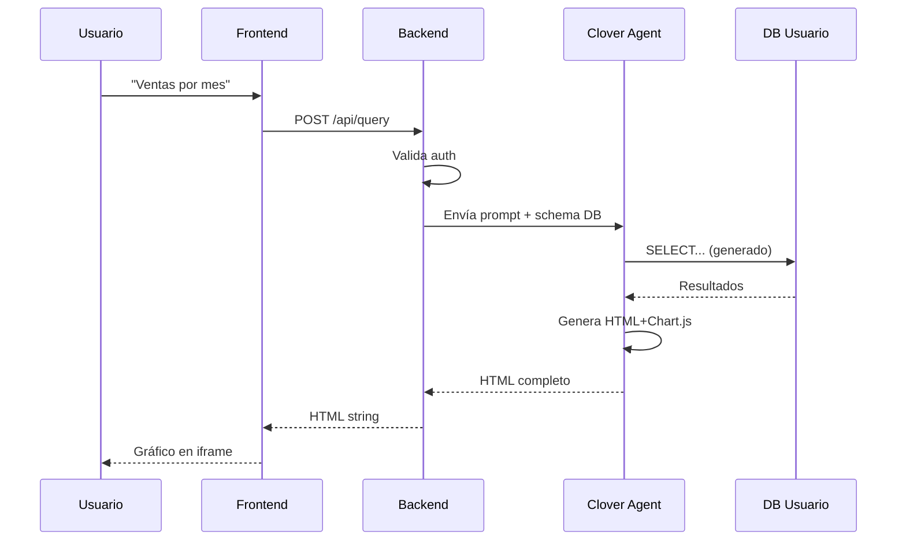

# 🍀 Clover BI - MVP (Minimum Viable Product)

## Objetivo del MVP

Demostrar que un usuario puede:
1. Conectar una base de datos PostgreSQL
2. Hacer una pregunta en español
3. Ver un gráfico como respuesta

**Nada más. Nada menos.**

---

## Scope del MVP

### ✅ Incluido

| Feature | Descripción |
|---------|-------------|
| **1 tipo de DB** | PostgreSQL únicamente |
| **Auth básica** | Login simple (email/password) |
| **1 conexión** | Una DB por usuario |
| **Preguntas NL** | En español |
| **Gráficos básicos** | Bar, Line, Pie (Chart.js) |
| **Tablas** | Resultados tabulares |
| **Historial** | Últimas 10 consultas |

### ❌ Excluido (Post-MVP)

- MySQL, SQL Server, SQLite
- Múltiples conexiones
- Dashboards guardados
- Compartir gráficos
- Exportar a PDF/Excel
- Alertas automáticas
- API pública

---

## Pantallas MVP



### 1. Login
- Email + Password
- Registro simple
- Sin OAuth (MVP)

### 2. Setup DB (primera vez)
- Host, puerto, usuario, password
- Nombre de base de datos
- Botón "Probar conexión"
- Guardar credenciales encriptadas

### 3. Chat BI (pantalla principal)
- Input de texto grande
- "¿Qué querés saber de tus datos?"
- Historial lateral (últimas consultas)
- Área de resultado debajo

### 4. Resultado
- iframe con gráfico interactivo
- O tabla de datos
- Botón "Nueva consulta"

---

## Stack MVP

```
Frontend:  Next.js 15 + Tailwind v4
Backend:   Fastify 5 + Prisma 6
Agent:     Clovers Platform (clovers/base:v3)
DB:        PostgreSQL 16 (datos de usuario)
Auth:      JWT simple
```

---

## Arquitectura MVP



---

## Criterios de Éxito

| Métrica | Target |
|---------|--------|
| Tiempo setup DB | < 2 minutos |
| Tiempo respuesta | < 10 segundos |
| Precisión consultas | > 80% correctas |
| UI usable | Sin manual |

---

## Timeline Estimado

| Semana | Entregable |
|--------|------------|
| 1 | Backend básico + Auth |
| 2 | Frontend Login + Setup DB |
| 3 | Integración Clover Agent |
| 4 | Chat BI + Resultados |
| 5 | Testing + Fixes |
| 6 | Deploy + Beta cerrada |

**Total: ~6 semanas para MVP**

---

## Riesgos

| Riesgo | Mitigación |
|--------|------------|
| Agent genera SQL incorrecto | Validación + retry |
| Queries lentas | Timeout + mensaje |
| Credenciales DB | Encriptación AES |
| Costos API Claude | Rate limit + cache |

---

*Siguiente: [05-Roadmap](05-roadmap.md)*
