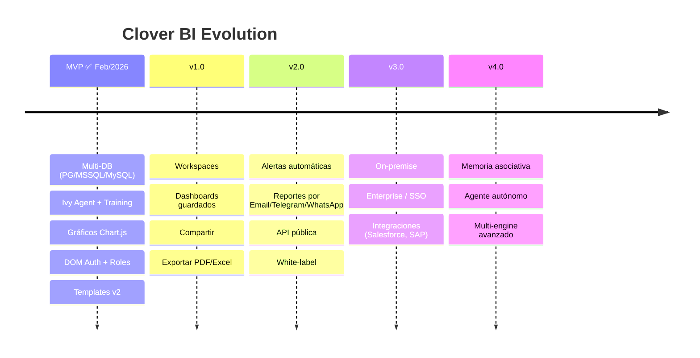

# 🍀 Clover BI - Roadmap

## Visión de Fases

---

## Fase 1: MVP ✅ COMPLETADO (Feb 2026)

> "Funciona. Es útil. Es simple."

### Entregables
- [x] Documentación completa
- [x] **Auth con DOM** (login, logout, roles, ATR) — superó JWT original
- [x] **Multi-DB: PostgreSQL, MSSQL, MySQL** — superó el scope inicial (solo PostgreSQL)
- [x] **Chat con Ivy Agent** (WebSocket, training, dashboards en lenguaje natural)
- [x] **Gráficos en iframe** (Chart.js — barras, líneas, torta, KPIs, dark/light mode)
- [x] **Deploy en producción** (https://clover.neosolutions.com.ar)
- [x] **Sidebar con navegación por roles** (data_trainer / data_analyst)
- [x] **Templates v2** (Ivy-Native Templating, multi-query, save/load)
- [x] **DOM integration completa** (multi-tenant, org configs dinámicos)
- [ ] Beta cerrada (5-10 usuarios) — *en curso: demos con Digital Flow*

### Métricas de Éxito
- Usuario puede hacer consultas sin ayuda ✅
- Tiempo de respuesta < 10s ✅
- 80%+ consultas generan resultados útiles ✅

---

## Fase 2: v1.0 - Producto Completo (Semanas 7-14)

> "Listo para vender."

### Features
- [ ] **Multi-DB**: MySQL, SQL Server, SQLite
- [ ] **Múltiples conexiones** por usuario
- [ ] **Dashboards guardados**: Guardar consultas favoritas
- [ ] **Compartir**: Links públicos a gráficos
- [ ] **Exportar**: PNG, PDF
- [ ] **Planes de pago**: Free, Pro, Enterprise
- [ ] **Onboarding mejorado**: Tour guiado

### Integraciones
- [ ] Stripe (pagos)
- [ ] SendGrid (emails)
- [ ] Sentry (errores)

---

## Fase 3: v2.0 - Automatización (Semanas 15-24)

> "El BI trabaja para vos."

### Features
- [ ] **Alertas**: "Avisame si ventas bajan 20%"
- [ ] **Reportes programados**: Emails semanales
- [ ] **API pública**: Integrar en otras apps
- [ ] **Webhooks**: Notificaciones automáticas
- [ ] **White-label**: Personalizar colores/logo
- [ ] **Teams**: Múltiples usuarios por cuenta

### AI Mejorado
- [ ] Sugerencias de consultas
- [ ] Detección de anomalías
- [ ] Insights automáticos

---

## Fase 4: v3.0 - Enterprise (Semanas 25+)

> "Para los grandes."

### Features
- [ ] **On-premise**: Instalación en servidor del cliente
- [ ] **SSO**: SAML, OAuth empresarial
- [ ] **Audit logs**: Registro de todas las acciones
- [ ] **SLA**: Uptime garantizado
- [ ] **Soporte dedicado**: Account manager

### Integraciones Enterprise
- [ ] Salesforce
- [ ] SAP
- [ ] Oracle
- [ ] Snowflake
- [ ] BigQuery

---

## Pricing Roadmap

| Fase | Plan | Precio | Features |
|------|------|--------|----------|
| MVP | Beta | Gratis | Acceso temprano |
| v1.0 | Free | $0 | 50 consultas/mes, 1 DB |
| v1.0 | Pro | $29/mes | Ilimitado, 5 DBs |
| v2.0 | Team | $99/mes | 5 usuarios, alertas |
| v3.0 | Enterprise | Custom | On-premise, SLA |

---

## Tech Debt a Resolver

| Item | Cuándo |
|------|--------|
| Tests unitarios | v1.0 |
| Tests e2e | v1.0 |
| CI/CD pipeline | v1.0 |
| Monitoreo (Grafana) | v1.0 |
| Documentación API | v2.0 |
| i18n (multi-idioma) | v2.0 |

---

## Competencia a Observar

| Producto | Qué copiar | Qué evitar |
|----------|------------|------------|
| Metabase | Simplicidad | Complejidad SQL |
| Tableau | Visualizaciones | Precio/complejidad |
| Mode | Colaboración | Curva de aprendizaje |
| ThoughtSpot | NL queries | Solo enterprise |

---

## KPIs por Fase

| Fase | Métrica | Target |
|------|---------|--------|
| MVP | Usuarios beta | 10 |
| v1.0 | Usuarios pagos | 50 |
| v1.0 | MRR | $1,000 |
| v2.0 | Usuarios pagos | 200 |
| v2.0 | MRR | $5,000 |
| v3.0 | Enterprise deals | 3 |

---

## Decisiones Pendientes

- [ ] ¿Freemium o trial?
- [ ] ¿Self-serve o demo calls?
- [ ] ¿Nombre final? (Clover BI vs otro)
- [ ] ¿Dominio? (cloverbi.com, clover.bi, etc)

---

*Este roadmap es flexible y se ajusta según feedback del mercado.*

*Producto de [Digital Flow](https://digitalflow.ar) 🚀*
*Powered by [Clovers Platform](../../Clovers/) 🍀*

---

## 📋 Backlog

### ✅ Completado
- [x] **Landing page** - askcloverbi.com (2026-02-16)
- [x] **Integración con DOM (DataOilManager)** - Login, logout, roles, deploy producción
  - 📄 Ver: [Plan de Integración](10-plan-integracion-dom.md)

### 🔄 Pendientes

#### Autenticación & Multi-tenancy
- [ ] **ATR (Automatic Token Rotation)** - Seguridad mejorada (no prioritario)
- [ ] **Organization Configs para DB** - Multi-tenant dinámico, cada cliente su DB

#### Real-time & Performance
- [ ] **WebSocket para dashboards** - Conexión persistente, progress en tiempo real
- [ ] **Guardar HTML generado** - Cache de dashboards para queries repetidas

#### UX & Features
- [ ] **Progress indicators** - Mostrar progreso durante queries largas
- [ ] **Modo edición post-generación** - Ajustar dashboards sin regenerar todo
- [ ] **Historial de queries** - Ver consultas anteriores y re-ejecutarlas
- [ ] **Favoritos/Templates** - Guardar dashboards favoritos
- [ ] **Links compartibles** - URL pública para compartir sin login
- [ ] **Preferencias guardadas** - Modo oscuro/claro, idioma, conexión default

#### Exportación
- [ ] **Exportar a PDF** - Dashboard completo como documento
- [ ] **Exportar tablas a Excel** - Datos en formato .xlsx

#### Automatización
- [ ] **Scheduler de reportes** - Dashboards automáticos con envío por email

#### Mobile & PWA
- [ ] **Mobile responsive** - Dashboards adaptables a celular/tablet
- [ ] **PWA** - Instalar como app en celular/desktop

#### Marketing

#### Wow Factor
- [ ] **Consultas por voz** - Web Speech API

#### 🚀 Sprint Febrero 2026 (Meet 16/02)

##### 🔴 URGENT
- [ ] **Implementar templates y guardado de consultas** (UI + backend) @David
  - 📄 Ver: [Plan v2 - Ivy-Native](12-plan-templates-v2.md) ← NUEVO
  - 📄 Ver: [Plan de Implementación](11-plan-templates.md)

##### 🟠 HIGH
- [ ] **Normalizar Data** - Evitar inconsistencias en dashboards @David
- [ ] **Configurar envío de reportes por e-mail** (MVP) y cuenta de correo @David
- [ ] **Evaluar opciones de hosting/servidores con GPU** y soporte @David

##### 📋 Generales
- [ ] Cambiar de dominio a cloverbi
- [ ] Monitoreo de costos
- [ ] Chatbot para página para atender leads

---

## 🐳 Versiones de Imagen Docker

### clovers/base:v4 (actual) ✅
- Herramienta SQL integrada: `/app/tools/sql.mjs`
- Soporta: PostgreSQL, MSSQL, MySQL
- El agente ejecuta queries directo, sin pasar por backend
- Lanzada: 2026-02-14 (San Valentín 💚)

### Historial
| Versión | Cambios |
|---------|---------|
| v1 | Base inicial OpenClaw |
