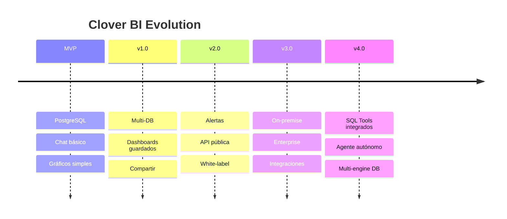

# 🍀 Clover BI - Roadmap

## Visión de Fases

---

## Fase 1: MVP (Semanas 1-6)

> "Funciona. Es útil. Es simple."

### Entregables
- [x] Documentación completa
- [ ] Auth básica (JWT)
- [ ] Conexión PostgreSQL
- [ ] Chat con Clover Agent
- [ ] Gráficos en iframe (Chart.js)
- [ ] Deploy en producción
- [ ] Beta cerrada (5-10 usuarios)

### Métricas de Éxito
- Usuario puede hacer consultas sin ayuda
- Tiempo de respuesta < 10s
- 80%+ consultas generan resultados útiles

---

## Fase 2: v1.0 - Producto Completo (Semanas 7-14)

> "Listo para vender."

### Features
- [ ] **Multi-DB**: MySQL, SQL Server, SQLite
- [ ] **Múltiples conexiones** por usuario
- [ ] **Dashboards guardados**: Guardar consultas favoritas
- [ ] **Compartir**: Links públicos a gráficos
- [ ] **Exportar**: PNG, PDF
- [ ] **Planes de pago**: Free, Pro, Enterprise
- [ ] **Onboarding mejorado**: Tour guiado

### Integraciones
- [ ] Stripe (pagos)
- [ ] SendGrid (emails)
- [ ] Sentry (errores)

---

## Fase 3: v2.0 - Automatización (Semanas 15-24)

> "El BI trabaja para vos."

### Features
- [ ] **Alertas**: "Avisame si ventas bajan 20%"
- [ ] **Reportes programados**: Emails semanales
- [ ] **API pública**: Integrar en otras apps
- [ ] **Webhooks**: Notificaciones automáticas
- [ ] **White-label**: Personalizar colores/logo
- [ ] **Teams**: Múltiples usuarios por cuenta

### AI Mejorado
- [ ] Sugerencias de consultas
- [ ] Detección de anomalías
- [ ] Insights automáticos

---

## Fase 4: v3.0 - Enterprise (Semanas 25+)

> "Para los grandes."

### Features
- [ ] **On-premise**: Instalación en servidor del cliente
- [ ] **SSO**: SAML, OAuth empresarial
- [ ] **Audit logs**: Registro de todas las acciones
- [ ] **SLA**: Uptime garantizado
- [ ] **Soporte dedicado**: Account manager

### Integraciones Enterprise
- [ ] Salesforce
- [ ] SAP
- [ ] Oracle
- [ ] Snowflake
- [ ] BigQuery

---

## Pricing Roadmap

| Fase | Plan | Precio | Features |
|------|------|--------|----------|
| MVP | Beta | Gratis | Acceso temprano |
| v1.0 | Free | $0 | 50 consultas/mes, 1 DB |
| v1.0 | Pro | $29/mes | Ilimitado, 5 DBs |
| v2.0 | Team | $99/mes | 5 usuarios, alertas |
| v3.0 | Enterprise | Custom | On-premise, SLA |

---

## Tech Debt a Resolver

| Item | Cuándo |
|------|--------|
| Tests unitarios | v1.0 |
| Tests e2e | v1.0 |
| CI/CD pipeline | v1.0 |
| Monitoreo (Grafana) | v1.0 |
| Documentación API | v2.0 |
| i18n (multi-idioma) | v2.0 |

---

## Competencia a Observar

| Producto | Qué copiar | Qué evitar |
|----------|------------|------------|
| Metabase | Simplicidad | Complejidad SQL |
| Tableau | Visualizaciones | Precio/complejidad |
| Mode | Colaboración | Curva de aprendizaje |
| ThoughtSpot | NL queries | Solo enterprise |

---

## KPIs por Fase

| Fase | Métrica | Target |
|------|---------|--------|
| MVP | Usuarios beta | 10 |
| v1.0 | Usuarios pagos | 50 |
| v1.0 | MRR | $1,000 |
| v2.0 | Usuarios pagos | 200 |
| v2.0 | MRR | $5,000 |
| v3.0 | Enterprise deals | 3 |

---

## Decisiones Pendientes

- [ ] ¿Freemium o trial?
- [ ] ¿Self-serve o demo calls?
- [ ] ¿Nombre final? (Clover BI vs otro)
- [ ] ¿Dominio? (cloverbi.com, clover.bi, etc)

---

*Este roadmap es flexible y se ajusta según feedback del mercado.*

*Producto de [Digital Flow](https://digitalflow.ar) 🚀*
*Powered by [Clovers Platform](../../Clovers/) 🍀*

---

## 📋 Backlog

### Cache & Performance
- [ ] **Guardar HTML generado** - Cache de dashboards para queries repetidas. Ahorra tokens y mejora tiempo de respuesta.

### Automatización
- [ ] **Scheduler de reportes** - Programar dashboards automáticos (diario/semanal/mensual) con envío por email.

### UX
- [ ] **Modo edición post-generación** - Ajustar dashboards después de creados: cambiar tipo de gráfico, colores, quitar/agregar secciones sin regenerar todo.

### Exportación
- [ ] **Exportar a PDF** - Dashboard completo (gráficos + KPIs + informe) como documento PDF.
- [ ] **Exportar tablas a Excel** - Solo las tablas de datos en formato .xlsx para análisis externo.

### Mobile
- [ ] **Mobile responsive** - Dashboards adaptables a pantallas de celular/tablet. Gráficos que se redimensionan, KPIs en stack vertical.

---

## 🐳 Versiones de Imagen Docker

### clovers/base:v4 (actual) ✅
- Herramienta SQL integrada: `/app/tools/sql.mjs`
- Soporta: PostgreSQL, MSSQL, MySQL
- El agente ejecuta queries directo, sin pasar por backend
- Lanzada: 2026-02-14 (San Valentín 💚)

### Historial
| Versión | Cambios |
|---------|---------|
| v1 | Base inicial OpenClaw |
| v2 | Mejoras de entrypoint |
| v3 | Smart entrypoint + ANTHROPIC_API_KEY |
| **v4** | **SQL tools integrados** |

