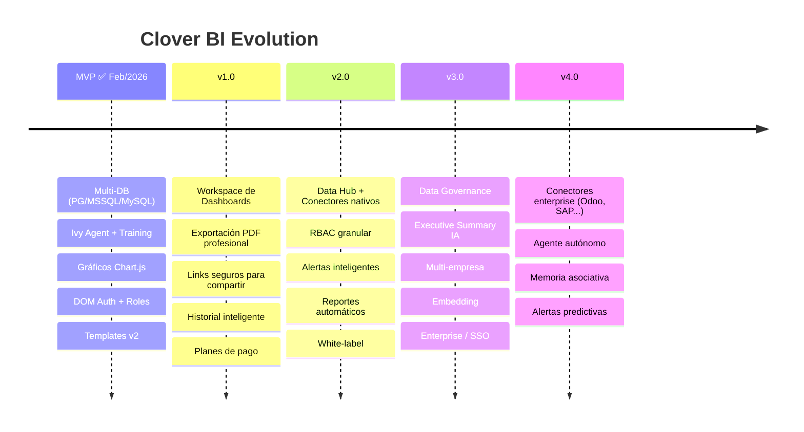

# 🍀 Clover BI - Roadmap

> **Posicionamiento:** Plataforma de Inteligencia Ejecutiva Conversacional para Empresas Medianas y Grandes.

---

## 📋 Changelog

| Fecha | Versión | Cambios |
|-------|---------|---------|
| 2026-02-25 | v2 | Integración propuesta estratégica Juan Toro / Gonzalo Huerta — "Ruta de Mejoras" |
| 2026-02-16 | v1 | Roadmap inicial — planificación de producto |

---

## Visión de Fases

---

## Fase 1: MVP ✅ COMPLETADO (Feb 2026)

> "Funciona. Es útil. Es simple."

### Entregables
- [x] Documentación completa
- [x] **Auth con DOM** (login, logout, roles, ATR) — superó JWT original
- [x] **Multi-DB: PostgreSQL, MSSQL, MySQL** — superó el scope inicial (solo PostgreSQL)
- [x] **Chat con Ivy Agent** (WebSocket, training, dashboards en lenguaje natural)
- [x] **Gráficos en iframe** (Chart.js — barras, líneas, torta, KPIs, dark/light mode)
- [x] **Deploy en producción** (https://clover.neosolutions.com.ar)
- [x] **Sidebar con navegación por roles** (data_trainer / data_analyst)
- [x] **Templates v2** (Ivy-Native Templating, multi-query, save/load)
- [x] **DOM integration completa** (multi-tenant, org configs dinámicos)
- [x] **Landing page** - askcloverbi.com
- [ ] Beta cerrada (5-10 usuarios) — *en curso: demos con Digital Flow*

### Métricas de Éxito
- Usuario puede hacer consultas sin ayuda ✅
- Tiempo de respuesta < 10s ✅
- 80%+ consultas generan resultados útiles ✅

---

## Fase 2: v1.0 - Producto Completo

> "Listo para vender."

### 🗂️ Workspace de Dashboards
- [ ] Guardar dashboards generados dinámicamente
- [ ] Reutilizar consultas con modificación de rango de fechas
- [ ] Editar métricas y visualizaciones post-generación
- [ ] Agregar / eliminar paneles
- [ ] Exportar dashboards completos
- [ ] Versionar dashboards (v1, v2, etc.)

### 📄 Exportación Profesional
- [ ] **PDF corporate-ready** — logo del cliente + fecha + usuario que generó el reporte
- [ ] **Modo "Reporte Ejecutivo"** — resumen automático generado por IA al final del dashboard
- [ ] **Exportar tablas a Excel** (.xlsx)
- [ ] **Exportar gráficos a PNG**

### 🔗 Compartir Informes
- [ ] Generación de link privado con fecha de expiración
- [ ] Acceso con password opcional
- [ ] Vista solo lectura
- [ ] Registro de quién accedió (audit básico)

### 🕐 Historial & Experiencia
- [ ] Historial personal de consultas (usuario, fecha, resultado)
- [ ] Favoritos — marcar consultas frecuentes
- [ ] Repetir consulta con un clic
- [ ] Sugerencias basadas en uso previo
- [ ] Progress indicators durante queries largas
- [ ] Preferencias guardadas (dark/light mode, idioma, conexión default)

### 💳 Monetización
- [ ] **Planes de pago**: Free, Pro, Enterprise
- [ ] **Gestión de uso** — panel con créditos consumidos, consultas realizadas, plan contratado, upgrade directo
- [ ] Integración **Stripe** (pagos)
- [ ] **Onboarding mejorado** — tour guiado para nuevos usuarios

### 🔧 Infraestructura
- [ ] **Organization Configs para DB** — multi-tenant dinámico, cada cliente su propia DB
- [ ] **WebSocket para dashboards** — conexión persistente, progress en tiempo real
- [ ] **Cache de dashboards** — guardar HTML generado para queries repetidas
- [ ] Integración **SendGrid** (emails transaccionales)
- [ ] Integración **Sentry** (monitoreo de errores)

---

## Fase 3: v2.0 - Conectividad & Automatización

> "El BI trabaja para vos."

### 🔌 Data Hub — Centro de Conectores
- [ ] Subida manual de **Excel / CSV**
- [ ] Conexión a múltiples bases de datos simultáneas
- [ ] Modelado simple (join de tablas entre fuentes)
- [ ] Enriquecimiento de la base principal con datos externos

### 🌐 Conectores Nativos
- [ ] Google Sheets
- [ ] Excel Online / OneDrive
- [ ] Google Drive
- [ ] API REST (cualquier endpoint)
- [ ] Webhooks (datos en tiempo real)

### 🔐 RBAC — Roles y Permisos Granulares
- [ ] Acceso por módulo (Explorar, Workspace, Alertas, Admin)
- [ ] Acceso por tipo de dato
- [ ] Restricción por área (Finanzas, Logística, Ventas, etc.)
- [ ] **Row-level security** — usuario ve solo su sucursal / región
- [ ] Gestión de equipos — múltiples usuarios por cuenta

### 📋 Logs & Auditoría
- [ ] Registro completo: usuario, fecha, IP, tiempo de ejecución, resultado generado
- [ ] Seguridad y control interno
- [ ] Base para cumplimiento normativo

### 🚨 Alertas Inteligentes
- [ ] "Avisame si ventas bajan 20% vs semana pasada"
- [ ] "Stock crítico detectado"
- [ ] Envío por email / Telegram / WhatsApp
- [ ] Configuración por umbral o variación

### 📅 Automatización
- [ ] **Scheduler de reportes** — dashboards automáticos con frecuencia configurable
- [ ] Envío por email programado
- [ ] **API pública** — integrar consultas en otras apps
- [ ] Webhooks de salida (notificaciones externas)

### 🎨 White-label
- [ ] Personalización de colores y logo por cliente
- [ ] Dominio propio del cliente

### 🛟 Status & Soporte
- [ ] Status en tiempo real de la plataforma
- [ ] SLA básico
- [ ] Chat de soporte integrado
- [ ] Sistema de ticketing
- [ ] Base de conocimiento

---

## Fase 4: v3.0 - Enterprise

> "Para los grandes."

### 🏛️ Data Governance Layer
- [ ] Diccionario de datos oficial
- [ ] Definición certificada de métricas y KPIs
- [ ] Validación de consistencia — evita que cada área calcule "ventas" diferente
- [ ] Indicador visual de calidad: 🟢 Validados / 🟡 Combinados externos / 🔴 Sin validar

### 🧠 Executive Summary IA — Narrativa Automática
- [ ] Después de cada dashboard: resumen ejecutivo generado automáticamente
  > *"Las ventas crecieron 8% impulsadas por la categoría X. El margen cayó 2% por costos logísticos."*
- [ ] Modo presentación para directorios y reuniones de board

### 🏢 Multi-empresa / Multi-base
- [ ] Soporte para holdings con múltiples unidades de negocio
- [ ] Comparación entre unidades en un mismo dashboard
- [ ] Consolidado automático entre bases

### 🔗 Embedding & White Label Avanzado
- [ ] Integrar Ask Clover BI dentro de otro sistema (iframe + JS SDK)
- [ ] API para consultas externas
- [ ] White label completo para partners / resellers

### ⚡ Performance Enterprise
- [ ] Cache inteligente de queries frecuentes
- [ ] Query optimization automático
- [ ] Modo alta performance para bases de datos grandes
- [ ] **Control de costos por consulta** — empresas grandes saben cuánto cuesta cada query

### 🔒 Seguridad Enterprise
- [ ] **On-premise** — instalación en servidor del cliente
- [ ] **SSO** — SAML, OAuth empresarial
- [ ] **SLA** garantizado con uptime
- [ ] Soporte dedicado / Account manager
- [ ] Audit logs completo para cumplimiento normativo

---

## Fase 5: v4.0 - Futuro

> "Más allá del BI tradicional."

### 🔌 Conectores Enterprise
- [ ] Odoo *(estratégico para Digital Flow)*
- [ ] SAP
- [ ] QuickBooks
- [ ] HubSpot
- [ ] Shopify
- [ ] Salesforce
- [ ] Oracle
- [ ] Snowflake
- [ ] BigQuery

### 🤖 IA Avanzada
- [ ] **Alertas predictivas** — anticipa problemas antes de que ocurran
- [ ] **Memoria asociativa** — el agente recuerda contexto entre sesiones
- [ ] **Agente autónomo** — monitorea y actúa sin intervención humana
- [ ] **Consultas por voz** — Web Speech API

### 📱 Mobile & PWA
- [ ] Mobile responsive — dashboards adaptables a celular/tablet
- [ ] PWA — instalar como app en celular/desktop

---

## 💰 Pricing Roadmap

| Fase | Plan | Precio | Features principales |
|------|------|--------|---------------------|
| MVP | Beta | Gratis | Acceso temprano |
| v1.0 | Free | $0/mes | 50 consultas/mes, 1 DB |
| v1.0 | Pro | $29/mes | Ilimitado, 5 DBs, PDF export |
| v2.0 | Team | $99/mes | 5 usuarios, alertas, conectores |
| v3.0 | Enterprise | Custom | On-premise, SLA, white-label |

---

## 🛠️ Tech Debt a Resolver

| Item | Cuándo |
|------|--------|
| Tests unitarios | v1.0 |
| Tests e2e | v1.0 |
| CI/CD pipeline | v1.0 |
| Monitoreo (Grafana) | v1.0 |
| Documentación API pública | v2.0 |
| i18n (multi-idioma) | v2.0 |

---

## 🏆 Competencia a Observar

| Producto | Qué copiar | Qué evitar |
|----------|------------|------------|
| Metabase | Simplicidad | Complejidad SQL |
| Tableau | Visualizaciones | Precio/complejidad |
| Mode | Colaboración | Curva de aprendizaje |
| ThoughtSpot | NL queries | Solo enterprise |
| Power BI | Conectores nativos | Dependencia Microsoft |

---

## 📊 KPIs por Fase

| Fase | Métrica | Target |
|------|---------|--------|
| MVP | Usuarios beta | 10 |
| v1.0 | Usuarios pagos | 50 |
| v1.0 | MRR | $1,000 |
| v2.0 | Usuarios pagos | 200 |
| v2.0 | MRR | $5,000 |
| v3.0 | Enterprise deals | 3 |

---

## ❓ Decisiones Pendientes

- [ ] ¿Freemium o trial de 14 días?
- [ ] ¿Self-serve o demo calls para onboarding?
- [ ] ¿Nombre final? (Ask Clover BI vs Clover BI vs otro)
- [ ] ¿Dominio? (askcloverbi.com actual, cloverbi.com, clover.bi)
- [ ] ¿Chatbot en landing para atender leads?

---

## 📋 Backlog — Sprint Activo

### ✅ Completado
- [x] Landing page - askcloverbi.com (2026-02-16)
- [x] Integración completa con DOM — login, logout, roles, deploy producción

### 🔴 URGENTE
- [ ] **Workspace de Dashboards** — guardar, editar, versionar (UI + backend)
  - 📄 Ver: [Plan de Workspaces](10-workspaces.md)
- 🔄 **Templates — save/load completo** — *EN PROGRESO (2026-02-25)*
  - ✅ Backend API completo (`from-html`, CRUD)
  - ✅ `SaveTemplateModal` + botón "💾 Guardar" en Explorar
  - ✅ CLOVER metadata parser + multi-query
  - ❌ **Pendiente:** página de listado/carga de templates (Workspaces)
  - ❌ **Pendiente:** edición de parámetros al recargar (`{{fecha}}`, `{{sucursal}}`)
  - ❌ **Pendiente:** versioning de templates
  - 📄 Ver: [Plan v2 - Ivy-Native](12-plan-templates-v2.md)
  - 📄 Ver: [Plan de Implementación](11-plan-templates.md)

### 🟠 HIGH
- [ ] **Exportación PDF** — diseño corporate-ready
- [ ] **Historial de consultas** — ver y repetir queries anteriores
- [ ] **Normalizar Data** — evitar inconsistencias en dashboards
- [ ] **Progress indicators** — feedback visual durante queries largas
- [ ] **Configurar envío de reportes por e-mail** (MVP)

### 📋 Generales
- [ ] Cambiar dominio principal a cloverbi / definir estrategia de dominio
- [ ] Monitoreo de costos de infraestructura
- [ ] Chatbot en landing para atender leads
- [ ] Evaluar opciones de hosting con GPU

---

## 🐳 Versiones de Imagen Docker

### clovers/base:v4 (actual) ✅
- Herramienta SQL integrada: `/app/tools/sql.mjs`
- Soporta: PostgreSQL, MSSQL, MySQL
- El agente ejecuta queries directo, sin pasar por backend
- Lanzada: 2026-02-14 (San Valentín 💚)

| Versión | Cambios |
|---------|---------|
| v4 | SQL tools integradas, multi-DB |
| v1 | Base inicial OpenClaw |

---

*Este roadmap es flexible y se ajusta según feedback del mercado.*

*Producto de [Digital Flow](https://digitalflow.ar) 🚀*
*Powered by [Clovers Platform](../../Clovers/) 🍀*
