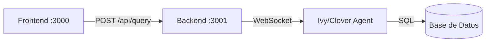

# 🚀 CloverBI Backend - Deployment

*Guía de deploy del Backend (Fastify API)*

---

## Arquitectura



El Backend es un **proxy** entre el Frontend y el Ivy/Clover Agent.

---

## Placeholders

| Placeholder | Descripción | Ejemplo |
|-------------|-------------|---------|
| `[IVY_CONTAINER]` | Nombre del container Ivy/Clover Agent | `clover-bi` |
| `[DOMINIO_IVY]` | Dominio del Ivy/Clover Agent | `clover.neosolutions.com.ar` |
| `[CLOVER_TOKEN]` | Gateway Token del agente | `b7de372ef0d3a2e...` |

---

## Prerequisito: Ivy/Clover Agent

El Ivy/Clover Agent debe estar corriendo.

```bash
# Verificar
docker ps | grep [IVY_CONTAINER]
curl -s http://localhost:19002/health
```

---

## 1. Obtener CLOVER_TOKEN

Extraer el Gateway Token del contenedor Ivy/Clover Agent:

```bash
docker exec [IVY_CONTAINER] cat /home/node/.openclaw/openclaw.json | grep token
```

Salida:
```
"token": "b7de372ef0d3a2edd5b5411ad5e4561c516090456ec50950"
```

**Guardar este valor.**

---

## 2. Build

```bash
cd backend
docker build -t cloverbi/backend:latest .
```

---

## 3. Deploy

```bash
docker run -d \
  --name cloverbi-backend \
  --restart unless-stopped \
  -p 127.0.0.1:3001:3001 \
  -e PORT=3001 \
  -e CLOVER_URL=wss://[DOMINIO_IVY]/ \
  -e CLOVER_TOKEN=[CLOVER_TOKEN] \
  cloverbi/backend:latest
```

---

## Variables de Entorno

| Variable | Requerida | Descripción | Default |
|----------|-----------|-------------|---------|
| `PORT` | No | Puerto del servidor | `3001` |
| `CLOVER_URL` | **Sí** | WebSocket URL del Ivy/Clover Agent | - |
| `CLOVER_TOKEN` | **Sí** | Gateway Token del agente | - |

---

## Verificar

```bash
# Logs
docker logs -f cloverbi-backend

# Health check
curl http://localhost:3001/health

# Test query
curl -X POST http://localhost:3001/api/query \
  -H "Content-Type: application/json" \
  -d '{"prompt": "Hola", "darkMode": true}'
```

---

## Ejemplo (Digital Flow)

```bash
docker run -d \
  --name cloverbi-backend \
  --restart unless-stopped \
  -p 127.0.0.1:3001:3001 \
  -e PORT=3001 \
  -e CLOVER_URL=wss://clover.neosolutions.com.ar/ \
  -e CLOVER_TOKEN=b7de372ef0d3a2edd5b5411ad5e4561c516090456ec50950 \
  cloverbi/backend:latest
```

---

## Operación

```bash
# Logs
docker logs -f cloverbi-backend

# Restart
docker restart cloverbi-backend

# Stop
docker stop cloverbi-backend

# Remove
docker rm cloverbi-backend

# Update
docker stop cloverbi-backend && docker rm cloverbi-backend
docker build -t cloverbi/backend:latest .
# Repetir docker run...
```

---

## Troubleshooting

| Problema | Causa | Solución |
|----------|-------|----------|
| No conecta a Ivy | Token incorrecto | Verificar CLOVER_TOKEN |
| No conecta a Ivy | URL incorrecta | Verificar CLOVER_URL (incluir `wss://` y `/`) |
| Timeout en queries | Ivy ocupada o caída | Verificar logs de Ivy |
| Connection refused | Container no corre | `docker ps` y restart |

---

*CloverBI - Digital Flow*
