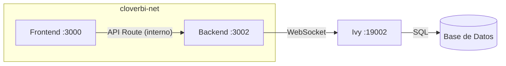

# 🚀 CloverBI Backend - Deployment

*Guía de deploy del Backend (Fastify API)*

---

## Arquitectura



El Backend es un **proxy interno** entre el Frontend y el Ivy/Clover Agent.

**⚠️ El backend NO se expone a internet.** Solo es accesible desde el frontend via red Docker.

---

## Placeholders

| Placeholder | Descripción | Ejemplo |
|-------------|-------------|---------|
| `[IVY_CONTAINER]` | Nombre del container Ivy/Clover Agent | `clover-bi` |
| `[DOMINIO_IVY]` | Dominio del Ivy/Clover Agent | `clover.neosolutions.com.ar` |
| `[CLOVER_TOKEN]` | Gateway Token del agente | `b7de372ef0d3a2e...` |

---

## Prerequisitos

### 1. Red Docker

```bash
docker network create cloverbi-net
```

### 2. Ivy/Clover Agent corriendo

```bash
# Verificar
docker ps | grep [IVY_CONTAINER]
curl -s http://localhost:19002/health
```

---

## 1. Obtener CLOVER_TOKEN

Extraer el Gateway Token del contenedor Ivy/Clover Agent:

```bash
docker exec [IVY_CONTAINER] cat /home/node/.openclaw/openclaw.json | grep token
```

Salida:
```
"token": "b7de372ef0d3a2edd5b5411ad5e4561c516090456ec50950"
```

**Guardar este valor.**

---

## 2. Build

```bash
cd backend
docker build -t cloverbi/backend:latest .
```

---

## 3. Deploy

```bash
docker run -d \
  --name cloverbi-backend \
  --network cloverbi-net \
  --restart unless-stopped \
  -p 127.0.0.1:3002:3002 \
  -e PORT=3002 \
  -e CLOVER_URL=wss://[DOMINIO_IVY]/ \
  -e CLOVER_TOKEN=[CLOVER_TOKEN] \
  -e DB_SERVER=[DB_SERVER] \
  -e DB_PORT=[DB_PORT] \
  -e DB_USER=[DB_USER] \
  -e DB_PASSWORD=[DB_PASSWORD] \
  -e DB_NAME=[DB_NAME] \
  -e CLIENT_DB_TYPE=[postgresql|mssql|mysql|mariadb] \
  -e CLIENT_DB_HOST=[CLIENT_DB_HOST] \
  -e CLIENT_DB_PORT=[CLIENT_DB_PORT] \
  -e CLIENT_DB_USER=[CLIENT_DB_USER] \
  -e CLIENT_DB_PASS=[CLIENT_DB_PASS] \
  -e CLIENT_DB_NAME=[CLIENT_DB_NAME] \
  cloverbi/backend:latest
```

**Nota:** Puerto 3002 (3001 está ocupado por otros servicios).

---

## Variables de Entorno

| Variable | Requerida | Descripción | Default |
|----------|-----------|-------------|---------|
| `PORT` | No | Puerto del servidor | `3002` |
| `CLOVER_URL` | **Sí** | WebSocket URL del Ivy/Clover Agent | - |
| `CLOVER_TOKEN` | **Sí** | Gateway Token del agente | - |
| `DB_SERVER` | **Sí** | Host del SQL Server interno (CloverBI DB) | - |
| `DB_PORT` | **Sí** | Puerto del SQL Server interno | `2433` |
| `DB_USER` | **Sí** | Usuario SQL Server interno | - |
| `DB_PASSWORD` | **Sí** | Password SQL Server interno | - |
| `DB_NAME` | **Sí** | Nombre de la base CloverBI | `CloverBI` |
| `CLIENT_DB_TYPE` | **Sí** | Tipo de DB del cliente (`postgresql`, `mssql`, `mysql`, `mariadb`) | - |
| `CLIENT_DB_HOST` | **Sí** | Host de la DB del cliente | - |
| `CLIENT_DB_PORT` | **Sí** | Puerto de la DB del cliente | - |
| `CLIENT_DB_USER` | **Sí** | Usuario de la DB del cliente | - |
| `CLIENT_DB_PASS` | **Sí** | Password de la DB del cliente | - |
| `CLIENT_DB_NAME` | **Sí** | Nombre de la DB del cliente | - |

---

## Verificar

```bash
# Logs
docker logs -f cloverbi-backend

# Health check
curl http://localhost:3002/health

# Ver env vars activas (passwords enmascaradas)
curl http://localhost:3002/api/env

# Test query
curl -X POST http://localhost:3002/api/query \
  -H "Content-Type: application/json" \
  -d '{"prompt": "Hola", "darkMode": true}'

# Verificar red
docker network inspect cloverbi-net
```

---

## Ejemplo Completo (Digital Flow - Aldyl)

```bash
# 1. Crear red (si no existe)
docker network create cloverbi-net

# 2. Deploy backend
docker run -d \
  --name cloverbi-backend \
  --network cloverbi-net \
  --restart unless-stopped \
  -p 127.0.0.1:3002:3002 \
  -e PORT=3002 \
  -e CLOVER_URL=wss://clover.neosolutions.com.ar/ \
  -e CLOVER_TOKEN=b7de372ef0d3a2edd5b5411ad5e4561c516090456ec50950 \
  -e DB_SERVER=154.12.252.27 \
  -e DB_PORT=2433 \
  -e DB_USER=sa \
  -e DB_PASSWORD=cloverfield161185 \
  -e DB_NAME=CloverBI \
  -e CLIENT_DB_TYPE=postgresql \
  -e CLIENT_DB_HOST=db.dataoil.app \
  -e CLIENT_DB_PORT=55005 \
  -e CLIENT_DB_USER=sa \
  -e CLIENT_DB_PASS=SeaLab2021 \
  -e CLIENT_DB_NAME=db_aldyl \
  cloverbi/backend:latest
```

---

## Operación

```bash
# Logs
docker logs -f cloverbi-backend

# Restart
docker restart cloverbi-backend

# Stop
docker stop cloverbi-backend

# Remove
docker rm cloverbi-backend

# Update
docker stop cloverbi-backend && docker rm cloverbi-backend
docker build -t cloverbi/backend:latest .
# Repetir docker run...
```

---

## Troubleshooting

| Problema | Causa | Solución |
|----------|-------|----------|
| No conecta a Ivy | Token incorrecto | Verificar CLOVER_TOKEN |
| No conecta a Ivy | URL incorrecta | Verificar CLOVER_URL (incluir `wss://` y `/`) |
| Timeout en queries | Ivy ocupada o caída | Verificar logs de Ivy |
| Connection refused | Container no corre | `docker ps` y restart |
| Frontend no conecta | Red incorrecta | Verificar ambos en `cloverbi-net` |
| Error DB cliente | Env vars incompletas | `curl localhost:3002/api/env` para diagnosticar |
| Execute endpoint falla | CLIENT_DB_* mal configuradas | Verificar tipo, host, puerto, user, pass, name |

---

*Actualizado: 2026-03-04*  
*CloverBI - Digital Flow*
