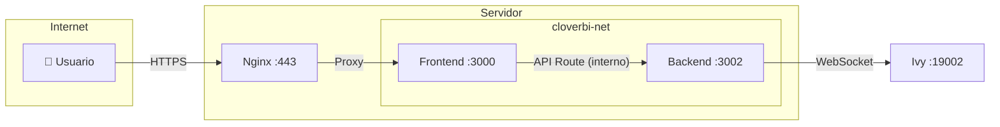

# 🚀 CloverBI Frontend - Deployment

*Guía de deploy del Frontend (Next.js)*

---

## Arquitectura de Red



**Importante:** El Backend NO está expuesto públicamente. Solo el Frontend recibe tráfico externo.

---

## Placeholders

| Placeholder | Descripción | Ejemplo |
|-------------|-------------|---------|
| `[DOMINIO_CLOVERBI]` | Dominio del frontend | `cloverbi.digitalflow.ar` |
| `[BACKEND_CONTAINER]` | Nombre del container backend | `cloverbi-backend` |

---

## Prerequisitos

### 1. Red Docker

Crear la red interna para comunicación frontend ↔ backend:

```bash
docker network create cloverbi-net
```

### 2. Backend corriendo

El backend debe estar en la misma red:

```bash
# Si ya existe, conectarlo a la red
docker network connect cloverbi-net cloverbi-backend

# O recrearlo con --network
docker run -d \
  --name cloverbi-backend \
  --network cloverbi-net \
  --restart unless-stopped \
  -p 127.0.0.1:3002:3002 \
  -e PORT=3002 \
  -e CLOVER_URL=wss://clover.neosolutions.com.ar/ \
  -e CLOVER_TOKEN=[CLOVER_TOKEN] \
  cloverbi/backend:latest
```

---

## 1. Dockerfile

Crear `frontend/Dockerfile`:

```dockerfile
# Build stage
FROM node:20-alpine AS builder
WORKDIR /app

COPY package*.json ./
RUN npm ci

COPY . .
RUN npm run build

# Production stage
FROM node:20-alpine AS runner
WORKDIR /app

ENV NODE_ENV=production

# Copiar archivos necesarios
COPY --from=builder /app/package*.json ./
COPY --from=builder /app/.next/standalone ./
COPY --from=builder /app/.next/static ./.next/static
COPY --from=builder /app/public ./public

EXPOSE 3000

CMD ["node", "server.js"]
```

### next.config.js (requerido para standalone)

```javascript
/** @type {import('next').NextConfig} */
const nextConfig = {
  output: 'standalone',
}

module.exports = nextConfig
```

---

## 2. Build

```bash
cd frontend
docker build -t cloverbi/frontend:latest .
```

---

## 3. Deploy

```bash
docker run -d \
  --name cloverbi-frontend \
  --network cloverbi-net \
  --restart unless-stopped \
  -p 127.0.0.1:3000:3000 \
  -e BACKEND_URL=http://cloverbi-backend:3002 \
  cloverbi/frontend:latest
```

**Nota:** `BACKEND_URL` usa el nombre del container porque están en la misma red Docker.

---

## 4. Nginx

Crear `/etc/nginx/sites-available/cloverbi`:

```nginx
server {
    listen 80;
    server_name [DOMINIO_CLOVERBI];
    return 301 https://$server_name$request_uri;
}

server {
    listen 443 ssl http2;
    server_name [DOMINIO_CLOVERBI];

    ssl_certificate /etc/letsencrypt/live/[DOMINIO_CLOVERBI]/fullchain.pem;
    ssl_certificate_key /etc/letsencrypt/live/[DOMINIO_CLOVERBI]/privkey.pem;

    location / {
        proxy_pass http://127.0.0.1:3000;
        proxy_http_version 1.1;
        proxy_set_header Upgrade $http_upgrade;
        proxy_set_header Connection 'upgrade';
        proxy_set_header Host $host;
        proxy_set_header X-Real-IP $remote_addr;
        proxy_set_header X-Forwarded-For $proxy_add_x_forwarded_for;
        proxy_set_header X-Forwarded-Proto $scheme;
        proxy_cache_bypass $http_upgrade;
    }
}
```

Habilitar:

```bash
ln -s /etc/nginx/sites-available/cloverbi /etc/nginx/sites-enabled/
nginx -t && systemctl reload nginx
```

---

## Variables de Entorno

| Variable | Requerida | Descripción | Default |
|----------|-----------|-------------|---------|
| `BACKEND_URL` | **Sí** | URL del backend (interno) | `http://localhost:3002` |

**En producción:** Usar nombre de container:
```
BACKEND_URL=http://cloverbi-backend:3002
```

---

## Verificar

```bash
# Logs
docker logs -f cloverbi-frontend

# Health check (desde el servidor)
curl http://localhost:3000

# Desde internet
curl https://[DOMINIO_CLOVERBI]
```

---

## Ejemplo Completo (Digital Flow)

```bash
# 1. Crear red
docker network create cloverbi-net

# 2. Backend (si no existe)
docker run -d \
  --name cloverbi-backend \
  --network cloverbi-net \
  --restart unless-stopped \
  -p 127.0.0.1:3002:3002 \
  -e PORT=3002 \
  -e CLOVER_URL=wss://clover.neosolutions.com.ar/ \
  -e CLOVER_TOKEN=b7de372ef0d3a2edd5b5411ad5e4561c516090456ec50950 \
  cloverbi/backend:latest

# 3. Frontend
docker run -d \
  --name cloverbi-frontend \
  --network cloverbi-net \
  --restart unless-stopped \
  -p 127.0.0.1:3000:3000 \
  -e BACKEND_URL=http://cloverbi-backend:3002 \
  cloverbi/frontend:latest
```

---

## Operación

```bash
# Logs
docker logs -f cloverbi-frontend

# Restart
docker restart cloverbi-frontend

# Stop
docker stop cloverbi-frontend

# Remove
docker rm cloverbi-frontend

# Update
docker stop cloverbi-frontend && docker rm cloverbi-frontend
cd frontend && docker build -t cloverbi/frontend:latest .
# Repetir docker run...
```

---

## Troubleshooting

| Problema | Causa | Solución |
|----------|-------|----------|
| No conecta a backend | Red incorrecta | Verificar ambos en `cloverbi-net` |
| No conecta a backend | Nombre incorrecto | Verificar `BACKEND_URL` usa nombre container |
| 502 Bad Gateway | Frontend no corre | `docker ps` y verificar logs |
| CSS/JS no carga | Build incompleto | Rebuild con `npm run build` |
| Training no conecta | Config falla | Verificar backend responde `/api/config` |

### Verificar red

```bash
# Ver containers en la red
docker network inspect cloverbi-net

# Probar conectividad interna
docker exec cloverbi-frontend wget -qO- http://cloverbi-backend:3002/health
```

---

## Resumen de Puertos

| Servicio | Puerto Interno | Puerto Expuesto | Expuesto a Internet |
|----------|---------------|-----------------|---------------------|
| Frontend | 3000 | 127.0.0.1:3000 | ✅ Sí (via Nginx) |
| Backend | 3002 | 127.0.0.1:3002 | ❌ No |
| Ivy | 19002 | - | ❌ No (tiene su Nginx) |

---

*Actualizado: 2026-02-14*  
*CloverBI - Digital Flow*
