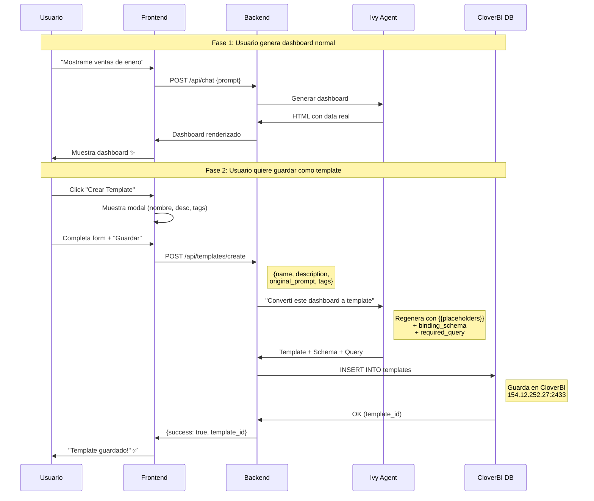
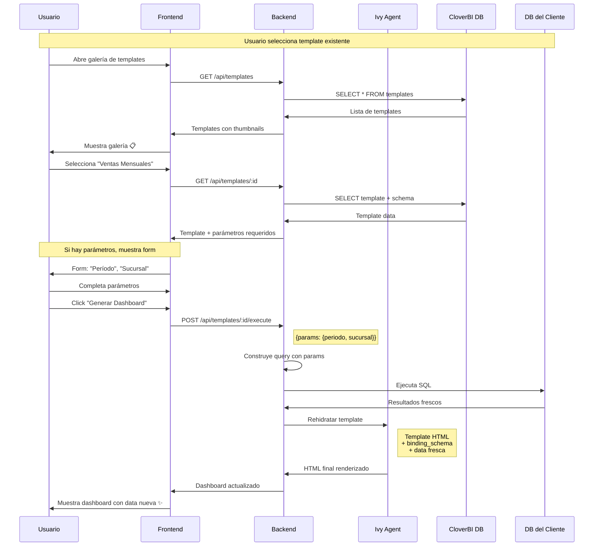

# 📋 Plan de Templates v2: Ivy-Native Templating

> **Estado:** 📝 Análisis  
> **Autor:** Cloe  
> **Fecha:** 2026-02-17  
> **Supersede:** 11-plan-templates.md (approach anterior)

---

## 🎯 Problema con el Approach Anterior

El plan original propone **tokenizar HTML post-facto**:
1. Ivy genera dashboard con data real
2. Un algoritmo busca valores en el HTML
3. Reemplaza por placeholders

**Problemas:**
- 🔴 **Frágil**: Buscar "1,500" en HTML puede romper CSS, IDs, etc.
- 🔴 **Sin contexto semántico**: No sabe si "100" es un total, un ID, o un año
- 🔴 **Charts rotos**: Datos de Chart.js están en `<script>`, difícil de parsear
- 🔴 **Valores duplicados**: Si "500" aparece 3 veces, ¿cuál es cuál?

---

## 💡 Propuesta: Ivy-Native Templating

**Concepto:** En vez de tokenizar después, que **Ivy genere el template directamente** cuando el usuario lo solicita.

### Flujo

```
Usuario: "Mostrame las ventas de enero"
        ↓
Ivy: Genera dashboard con data real
        ↓
Usuario: "Guardá esto como template"
        ↓
Ivy: Regenera el MISMO dashboard pero:
     - Usa {{placeholders}} con nombres semánticos
     - Genera el schema de binding
     - Documenta qué query ejecutar para llenar cada placeholder
        ↓
Sistema guarda: template + schema + query base
        ↓
Después el usuario elige el template
        ↓
Sistema: Ejecuta query → Ivy rehidrata → Dashboard actualizado
```

---


## 📊 Diagrama de Secuencia: Guardado de Template



## 📊 Diagrama de Secuencia: Ejecución de Template



---

## 🧠 Por Qué Funciona Mejor

| Aspecto | Post-facto (v1) | Ivy-Native (v2) |
|---------|-----------------|-----------------|
| Contexto semántico | ❌ Ninguno | ✅ Ivy sabe qué es cada dato |
| Charts | ❌ Hay que parsear JS | ✅ Ivy genera con placeholders |
| Valores duplicados | ❌ Ambiguo | ✅ Cada placeholder es único |
| Mantenibilidad | ❌ Regex frágil | ✅ Generación nativa |
| Flexibilidad | ❌ Solo reemplazo textual | ✅ Puede transformar datos |

---

## 📊 Modelo de Datos (Actualizado)

### Tabla: `templates`

| Campo | Tipo | Descripción |
|-------|------|-------------|
| id | UUID | PK |
| org_id | UUID | FK → organizations |
| user_id | UUID | FK → users (creador) |
| name | VARCHAR(255) | Nombre del template |
| description | TEXT | Descripción opcional |
| **base_prompt** | TEXT | Prompt original que generó el dashboard |
| **template_html** | TEXT | HTML con {{placeholders}} generado por Ivy |
| **binding_schema** | JSONB | Schema de cómo llenar cada placeholder |
| **required_query** | TEXT | Query SQL base (con parámetros) |
| thumbnail | TEXT | Preview en base64 |
| is_public | BOOLEAN | Compartido con la org |
| tags | VARCHAR[] | Tags para búsqueda |
| created_at | TIMESTAMP | |
| updated_at | TIMESTAMP | |

### Ejemplo `binding_schema`:

```json
{
  "version": "2.0",
  "placeholders": [
    {
      "key": "{{total_ventas}}",
      "label": "Total de Ventas",
      "type": "currency",
      "format": "$#,##0.00",
      "source": {
        "type": "query_result",
        "path": "rows[0].total"
      }
    },
    {
      "key": "{{chart_ventas_mensuales}}",
      "label": "Gráfico de Ventas",
      "type": "chart_data",
      "chartType": "bar",
      "source": {
        "type": "query_result",
        "path": "rows",
        "mapping": {
          "labels": "mes",
          "values": "monto"
        }
      }
    },
    {
      "key": "{{periodo_titulo}}",
      "label": "Período",
      "type": "date_range",
      "source": {
        "type": "parameter",
        "param": "date_range"
      }
    }
  ],
  "parameters": [
    {
      "name": "date_range",
      "type": "date_range",
      "label": "Período a consultar",
      "default": "last_month"
    },
    {
      "name": "sucursal",
      "type": "select",
      "label": "Sucursal",
      "options_query": "SELECT id, nombre FROM sucursales",
      "default": "all"
    }
  ]
}
```

---

## 🔌 Flujo de Ejecución de Template

### 1. Usuario Selecciona Template

```
GET /api/templates/:id
→ Retorna: template + binding_schema + parameters
```

### 2. UI Muestra Formulario de Parámetros

Si el template tiene `parameters`, mostrar formulario:
- Date picker para "Período"
- Select para "Sucursal"
- etc.

### 3. Usuario Ejecuta

```
POST /api/templates/:id/execute
Body: { 
  "parameters": {
    "date_range": { "from": "2026-01-01", "to": "2026-01-31" },
    "sucursal": "all"
  }
}
```

### 4. Backend Procesa

```javascript
async function executeTemplate(templateId, params) {
  const template = await getTemplate(templateId);
  
  // 1. Construir query con parámetros
  const query = buildQueryWithParams(template.required_query, params);
  
  // 2. Ejecutar query
  const result = await executeQuery(query, template.org_id);
  
  // 3. Enviar a Ivy para rehidratar
  const html = await ivy.hydrateTemplate({
    template: template.template_html,
    schema: template.binding_schema,
    data: result,
    params: params
  });
  
  return html;
}
```

### 5. Ivy Rehidrata

Ivy recibe el template + schema + data y:
- Reemplaza cada placeholder según el binding
- Formatea según el tipo (currency, date, chart_data)
- Retorna HTML listo para renderizar

---

## 🤖 Prompt para Ivy: Generar Template

Cuando el usuario dice "Guardá como template":

```
[SYSTEM]
El usuario quiere guardar el dashboard actual como template reutilizable.

Regenerá el mismo dashboard pero:
1. Reemplazá todos los valores dinámicos por placeholders: {{nombre_descriptivo}}
2. Usá nombres semánticos: {{total_ventas}}, {{chart_productos}}, {{fecha_reporte}}
3. NO uses valores literales para datos que pueden cambiar
4. Los charts deben tener placeholders para su data: {{chart_nombre_data}}

Respondé con:
1. HTML con placeholders
2. JSON del binding_schema
3. Query SQL base con parámetros (:param_name)

Formato de respuesta:
---TEMPLATE_HTML---
<html>...{{placeholders}}...</html>
---BINDING_SCHEMA---
{...json...}
---REQUIRED_QUERY---
SELECT ... WHERE fecha BETWEEN :date_from AND :date_to
```

---

## 🎨 UI Components

### 1. Botón "Guardar como Template" (en dashboard)

Solo aparece después de generar un dashboard exitoso.

```
[💾 Guardar] [📋 Crear Template] [📤 Compartir]
```

### 2. Modal "Crear Template"

```
┌─────────────────────────────────────────┐
│ 📋 Crear Template                    [X] │
├─────────────────────────────────────────┤
│                                         │
│ Nombre: [Ventas Mensuales por Sucursal] │
│                                         │
│ Descripción:                            │
│ [Dashboard de ventas con filtro por   ] │
│ [período y sucursal                   ] │
│                                         │
│ Tags: [ventas] [mensual] [+]            │
│                                         │
│ ☑ Compartir con mi organización         │
│                                         │
│ Preview:                                │
│ ┌─────────────────────────────────────┐ │
│ │ [Thumbnail del dashboard]           │ │
│ └─────────────────────────────────────┘ │
│                                         │
│ Parámetros detectados:                  │
│ • Período (date_range)                  │
│ • Sucursal (select)                     │
│                                         │
│        [Cancelar]  [Crear Template]     │
└─────────────────────────────────────────┘
```

### 3. Galería de Templates

```
┌─────────────────────────────────────────┐
│ 📋 Mis Templates              [+ Nuevo] │
├─────────────────────────────────────────┤
│ ┌─────────┐ ┌─────────┐ ┌─────────┐    │
│ │ [thumb] │ │ [thumb] │ │ [thumb] │    │
│ │ Ventas  │ │ Stock   │ │ Clientes│    │
│ │ Mensual │ │ Crítico │ │ Nuevos  │    │
│ │ ⭐⭐⭐⭐  │ │ ⭐⭐⭐    │ │ ⭐⭐⭐⭐⭐ │    │
│ └─────────┘ └─────────┘ └─────────┘    │
│                                         │
│ 🏢 Templates de la Organización         │
│ ┌─────────┐ ┌─────────┐                │
│ │ [thumb] │ │ [thumb] │                │
│ │ KPIs    │ │ P&L     │                │
│ │ Mensual │ │ Report  │                │
│ └─────────┘ └─────────┘                │
└─────────────────────────────────────────┘
```

### 4. Ejecución de Template

```
┌─────────────────────────────────────────┐
│ 📊 Ventas Mensuales por Sucursal        │
├─────────────────────────────────────────┤
│                                         │
│ Parámetros:                             │
│                                         │
│ Período: [Enero 2026      ] [📅]        │
│ Sucursal: [Todas          ] [▼]         │
│                                         │
│            [Generar Dashboard]          │
│                                         │
└─────────────────────────────────────────┘
```

---

## 📅 Plan de Ejecución

### Fase 1: Diseño y Documentación (Este documento) ✅

- [x] Definir el approach Ivy-Native
- [x] Diseñar modelo de datos
- [x] Diseñar binding_schema
- [x] Diseñar UI mockups
- [x] Documentar flujo de ejecución

### Fase 2: Backend (2-3 días)

- [ ] Migración: tabla `templates`
- [ ] Modelo + Repositorio
- [ ] Endpoints CRUD
- [ ] Endpoint `/execute`
- [ ] Tests unitarios

### Fase 3: Integración Ivy (1-2 días)

- [ ] Prompt para generar template
- [ ] Función `hydrateTemplate`
- [ ] Tests con dashboards reales

### Fase 4: Frontend (2-3 días)

- [ ] Botón "Crear Template"
- [ ] Modal de creación
- [ ] Galería de templates
- [ ] Formulario de parámetros
- [ ] Ejecución y preview

### Fase 5: Testing & Polish (1 día)

- [ ] E2E del flujo completo
- [ ] Edge cases
- [ ] Deploy a staging

**Estimación total:** 6-9 días

---

## ✅ Ventajas vs Plan Anterior

| Aspecto | v1 (Post-facto) | v2 (Ivy-Native) |
|---------|-----------------|-----------------|
| Precisión | ⚠️ Puede romper HTML | ✅ Semánticamente correcto |
| Charts | ❌ Muy difícil | ✅ Nativo |
| Parámetros | ❌ No soporta | ✅ First-class citizen |
| Mantenimiento | ❌ Regex frágil | ✅ Ivy lo entiende |
| Flexibilidad | ❌ Solo reemplazo | ✅ Transformaciones |
| Complejidad | ⚠️ Algoritmo complejo | ✅ Ivy hace el trabajo |

---

## ⚠️ Consideraciones

1. **Requiere buen prompting**: Ivy debe generar templates consistentes
2. **Costo de tokens**: Regenerar el dashboard como template usa tokens extra
3. **Versionado**: Si Ivy cambia, templates viejos podrían no funcionar igual

---

## 🔗 Referencias

- Plan anterior: `11-plan-templates.md`
- Roadmap: `05-roadmap.md`
- Ivy agent: `clovers/base:v4`

---

*Documento creado: 2026-02-17*  
*Autor: Cloe Cloverfield*
